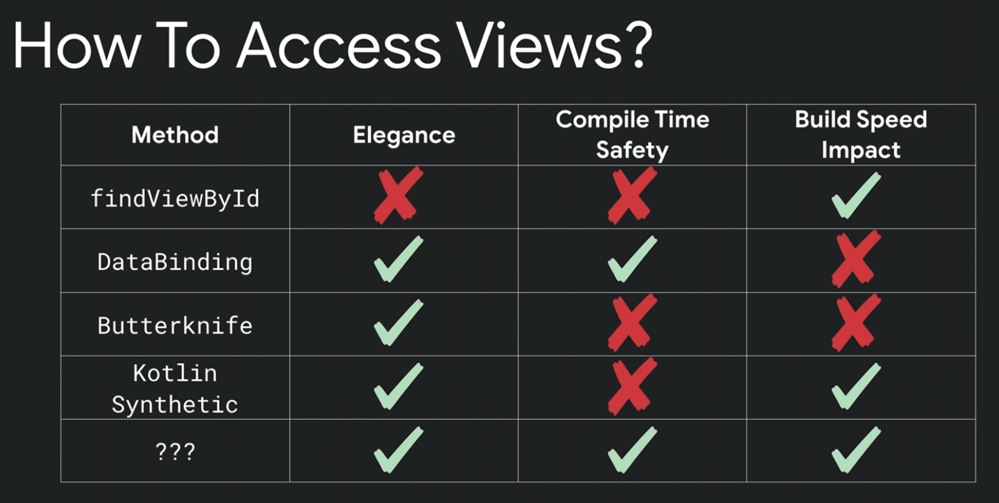

# View Binding

## 등장 배경

-   xml 상의 코드 즉, 화면에 나타나는 뷰를 참조할 때 findById와 같은 메서드로 접근하곤 합니다.
-   하지만 여러 문제가 생겼고, 대안을 고민하게 됩니다.
-   크게 세가지 지표로 고민을 했고, 거쳐온 과정은 아래 사진과 같습니다.

-   위 사진에서 가장 아래 있는 물음표가 View Binding입니다.

### findViewById

-   깔끔하지 못한 코드를 작성하게 되며 Null safety하지 않습니다.
-   모든 뷰에 대한 변수를 선언하게 되고, id가 틀리면 그대로 Null Pointer Exception이 발생합니다.

### Butter Knife

-   눈으로 보기에는 깔끔해졌지만 코드의 수는 여전히 같습니다.
-   라이브러리를 추가해서 사용합니다. 어노테이션 `@BindView(R.id.view)`를 사용해 변수에 할당할 수 있습니다.
-   리스너 역시 `@OnClick(R.id.view)`를 함수 위에 붙여 사용하면 됩니다.

### Kotlin Synthetic

-   간편하지만 런타임에 위험합니다.
-   같은 아이디를 가진 뷰를 사용할 때 런타임 오류가 생깁니다. 뷰가 복제되었을 때 역시 같은 아이디를 가졌다면 런타임에 오류가 발생합니다.
-   특히 RecyclerView를 사용한다면 오류를 피하기 어렵습니다.

### View Binding

-   binding 변수를 생성하면 바로 뷰를 참조할 수 있기 때문에 코드가 깔끔합니다.
-   Null Safety합니다. 직접 참조를 생성하므로 잘못된 id를 참조하면 실행조차 되지 않습니다.
-   Acitivity, Fragment 파일과 xml파일 자체를 연결합니다.

## View Binding 에서의 메모리 누수

-   Fragment에서 View Binding을 사용할 때, onDestroy 생명주기에 \_binding = null 처리를 해주는 모습을 볼 수 있습니다.
-   이는 backstack이나 detach를 사용할 경우, fragment view가 파괴되지만 fragment는 살아있기 때문에 view와의 연결을 끊어주는 과정입니다.
-   activity의 경우 view와 acitivity의 생명주기를 구분짓지 않기 때문에 굳이 필요하지 않습니다.